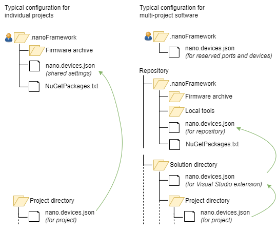

# `nano.devices.json` configuration

The .NET **nanoFramework** has a single configuration, `nano.devices.json`, that specifies which nanoDevices a project's software will be deployed to and what version of the .NET **nanoFramework** to use. This configuration is used by several .NET **nanoFramework** [tools](settings-used-by-nanoFramework-tools). This section provides a detailed description of the configuration.

## Content of a configuration file
The information on devices that are relevant for a single project, for a solution, a (git) repository for one or more products or for all of your devices is stored in  `nano.devices.json` files (comments allowed). A file that has all possible settings looks like:

```json
{
    "Import": [ "<path to configuration to import>" ],
    "NuGetPackageList": "<(relative) path to NuGetPackageList.txt file>",
    "NanoFFPath": "<localtools>/nanoff.exe",
    "NanoCLRPath": "<localtools>/nanoclr.exe",
    "FirmwareArchivePath": "<firmware>",
    "DeviceTypeTargets": {
        "Primary device": [ "ESP32_S3_ALL" ],
        "Alternative": [ "ESP32_S3_BLE" ],
        "Test devices": ["Virtual nanoDevice", "ESP32_S3_ALL", "ESP32_S3_BLE"]
    },
    "DeviceTypes": [
        "Primary device",
        "Virtual nanoDevice"
    ],
    "Platforms": [
        "ESP32"
    ],
    "Devices": [
        "100000000068B6B33CDA80": "ESP32_S3_ALL",
        "1000000000806C6A4B2919": {
            "Name": "Prototype #3",
            "Target": "ESP32_C6_THREAD"
        }
    ],
    "DeviceSelection": [
        "100000000068B6B33CDA80"
    ],
    "ReservedSerialPorts": ["COM5", "COM30", "COM31", "COM32", "COM33"]
}
```
with:

- `Import` is an array with one or more paths to other `nano.devices.json` files. Those files are read first, then the content of this file is used to overwrite the imported settings. The name of the file can be anything and does not have to be `nano.devices.json`.
- `NuGetPackageList` is the path to a [file](#nuget-package-list) that lists the allowed versions of the NuGet packages.
- `NanoFFPath` is the path to the `nanoff.exe` file that is used to deploy firmware, applications and files to a device. If it is not present, the global tool is used.
- `NanoCLRPath` is the path to the `nanoclr.exe` file that is used to run the Virtual nanoDevice. If it is not present, the global tool is used.
- `FirmwareArchivePath` is the path to the firmware archive; this is the same path as used in the `--archivepath` argument to *nanoff*.
- `DeviceTypeTargets` is a list of named device types, and per name a list with the name of the firmware/target to use. The firmware for a Virtual nanoDevice is named "Virtual nanoDevice". There are two predefined lists: *Hardware nanoDevice* for all devices excpet the Virtual Device, and *Virtual nanoDevice* for the Virtual Device only.
- `DeviceTypes` is a list of device types the project is designed to be deployed to. The names in the list must be *Hardware nanoDevice*, *Virtual nanoDevice* or a name defined in *DeviceTypeTargets*.
- `Platforms` is a list of platforms the project is designed to be deployed to. This is shorthand to select all devices that match the specified platform. If *FirmwareArchivePath* is specified, the list is limited to all devices for which firmware is present in the archive.
- `Devices` is a list of specific devices that are available to deploy the project to. A device is identified by its system serial number or module serial number. The value is either the firmware that is (or should be used) for the device, or a combination of the firmware name and a device name that can be used in user interfaces and in logging.
- `DeviceSelection` is a list of devices (as mentioned in *Devices*) the project is designed to be deployed to. 
- `ReservedSerialPorts` are used to limit the serial ports used in the discovery of real hardware nanoDevices. In the discovery process .NET nanoFramework software tries to communicate via the serial port, and some devices do not appreciate that. If you only have a few of these devices, you can add their serial port to the `ReservedSerialPorts` array as these are excluded from the discovery of real hardware nanoDevices.

A path to a file can be specified relative to the directory the `nano.devices.json` file resides in. It can also be an absolute path, and the path may contain environment variables like `%USERPROFILE%`. Instead of a `\` a '/' may be used. So `../.nanoFramework/nano.devices.json`, `c:\ProgramData\nanoFramework\nano.devices.json` and `%USERPROFILE%/.nanoFramework/nano.devices.json` are all valid paths.

All settings are optional, except for the values used in *DeviceTypes* that should be defined in *DeviceTypeTargets* in the same file or in an imported file.

Four settings determine whether the project is designed to be deployed to a device:

- If neither *DeviceTypes*, *Platforms* nor *DeviceSelection* is specified, the configuration does not provide any information about the devices the project is designed to be deployed to.
- If *DeviceTypes*, *Platforms* or *DeviceSelection* is specified, the project is designed to be deployed to devices that satisfy any of the criteria:
    - The firmware/target of the device matches the names specified by *DeviceTypes* combined with *DeviceTypeTargets*.
    - The platform of the device matches the names specified in *Platforms*.
    - The system serial number or module serial number matches any of the numbers specified for one of the *DeviceSelection* (if specified), regardless of the target specified for the device.
- If *FirmwareArchivePath* is specified, an additional criterion is that the firmware for a hardware device must be present in the firmware archive. 

## Hierarchy of configuration files



As illustrated by the diagram, the information on devices can be distributed over multiple `nano.devices.json` files. This is done to simplify the administration of the configuration. If multiple .NET **nanoFramework** projects are involved, most of the settings will be identical for all projects. Adding a new device type would require changing all project configurations. Instead the list of device types can be placed in a global `nano.devices.json` file (in *DeviceTypeTargets*); if the project configurations include that global file (via the *Import*), the new device type is immediately available to all projects.

The configuration files are read in a particular order:

- First the `nano.devices.json` is read in the project directory (or solution directory for the Visual Studio extension).
- If the *Import* is set, the imported files are processed first. Then the settings in the `nano.devices.json` being read overwrite the settings from the imported configuration:
    - If a top-level element (*NanoCLRPath*, *DeviceTypeTargets*, etc.) is present in both files, the one that is read first is overwritten by the setting read last.
    - If *DeviceTypeTargets* is present in both files, the lists are merged. In case the same name is present in both lists, the value from the imported file is overwritten. To remove a name from the list, set its value to `null`.
    - If *Devices* is present in both files, the lists are merged. In case the same device is present in both lists, the value from the imported file is overwritten by the name and firmware if those are provided. To remove a device from the list, set its value to `null`.
- This is done recursively: if the imported file has a *Import*, the configuration file in that directory is read first.
- If the file `%USERPROFILE%\.nanoFramework\nano.devices.json` exists, that file is read. The *Devices* and *ReservedSerialPorts* are added to the configuration.

The figure at the top of the page illustrates the hierarchy of configuration files.

If you adopt the daily update strategy, a typical use of `nano.devices.json` configurations is:

- In `%USERPROFILE%\.nanoFramework\nano.devices.json` you specify:
    - *NuGetPackageList*.
    - *FirmwareArchivePath*.
    - *DeviceTypeTargets*: the device types you use in your projects.
    - *Devices*: the devices available for debugging and testing.
    - *ReservedSerialPorts*: all serial ports that never are used on this machine to connect a real hardware nanoDevice to, but that are used when other devices are connected to the machine.
- In `nano.devices.json` in a project directory you specify:
    - *Import* = `%USERPROFILE%/.nanoFramework`.
    - *DeviceTypes* and/or *Platforms*: the device types you use in the project.

If you adopt the controlled update strategy, the configuration files are part of the (git) repository. A typical use of `nano.devices.json` configurations is:

- In a repository-wide `nano.devices.json` you specify:
    - *NuGetPackageList*. 
    - *FirmwareArchivePath*.
    - *DeviceTypeTargets*: the device types you use in your projects.
    - *NanoFFPath* if is is relevant to the projects in the repository.
- In `nano.devices.json` in a solution directory you specify:
    - *Import* = path to the repository-wide `nano.devices.json` file.
- In `nano.devices.json` in a project directory you specify:
    - *Import* = path to the repository-wide `nano.devices.json` file or to the `nano.devices.json` file in the solution directory.
    - *DeviceTypes* and/or *Platforms*: the device types you use in the project.
- In `%USERPROFILE%\.nanoFramework\nano.devices.json` you specify:
    - *Devices*: the devices available for debugging and testing.
    - *ReservedSerialPorts*: all serial ports that never are used on this machine to connect a real hardware nanoDevice to, but that are used when other devices are connected to the machine.

## Settings used by nanoFramework tools

An overview of the settings that are used by the various .NET **nanoFramework** tools.

| Setting | Used by |
| ------- | ------- |
| NuGetPackageList | [Consistency verification task](tools-configuration.md#consistency-verification-task)<sup>1</sup> |
| NanoFFPath | Not used by .NET **nanoFramework** tools but may be used by custom (community) tools |
| NanoCLRPath | Consistency verification task, Visual Studio extension<sup>3</sup>, test framework<sup>4</sup> |
| FirmwareArchivePath | Consistency verification task<sup>1</sup>, Visual Studio extension<sup>3</sup>, test framework<sup>4</sup> |
| DeviceTypeTargets | Consistency verification task<sup>2</sup> |
| DeviceTypes | Consistency verification task<sup>2</sup> |
| Platforms | Consistency verification task<sup>2</sup> |
| Devices | Consistency verification task<sup>2</sup>, Visual Studio extension<sup>3</sup> |
| DeviceSelection | Consistency verification task<sup>2</sup>, Visual Studio extension<sup>3</sup>, test framework<sup>4</sup> |
| ReservedSerialPorts | Visual Studio extension<sup>3</sup>, test framework<sup>4</sup> |

<sup>1</sup> This setting is required.<br>
<sup>2</sup> One of *Platforms*, *DeviceTypes* (with *DeviceTypeTargets*) and *DeviceSelection* (with *Devices*) is required.<br>
<sup>3</sup> Taken from the `nano.devices.json` that is located in the directory of the active startup project, in case that is a .NET **nanoFramework** project. Otherwise the `nano.devices.json` us used from the directory of the solution that has been opened in Visual Studio.<br>
<sup>4</sup> Applies to the [latest version](../unit-test/framework-v4) of the test framework.

Some custom tools are available as [samples](TODO) for the .NET **nanoFramework** library that implements most of the versioning support functionality.
