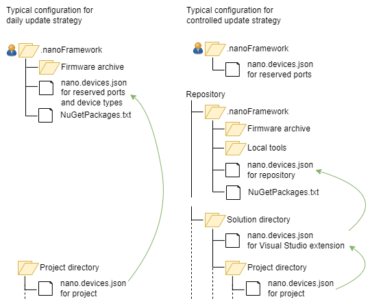

# Tools and configuration

The .NET **nanoFramework** has out-of-the-box support for the auto-update [versioning strategy](versioning-strategies.md). For the other supported strategies some extra configuration files and tools have to be added.

The configuration is also used by other tools that require information about the devices relevant for a project. These tools include the [Visual Studio extension](../getting-started-guides/getting-started-managed.md) and the latest version of the [test framework](../unit-test/framework-v3). Custom tools can use the configuration by using the [nanoFramework.Tooling.Devices](https://github.com/nanoframework/nf-tools) library.

The configuration consists of several components, depending on the adopted versioning strategy.



- A [local tools](#local-tools) directory (controlled update strategy only).
- A [firmware archive](#firmware-archive) that contains the firmware packages for the device types your software is intended to be deployed to.
- A list of [NuGet packages](#nuget-package-list) used in .NET **nanoFramework** projects.
- A description of the [configuration and devices](#configuration-and-devices) as stored in `nano.devices.json` files.

The first three components are created by running commands. These can be combined in an [update script](#update-script) that, in case of the daily update strategy, can be run every day.

To each .NET **nanoFramework** project for which a consistency check is required a [NuGet package](#consistency-verification-task) should be added that verifies the consistency of the NuGet packages used by the project, the packages in the NuGet package list and the firmware for the devices the projects is intended to be deployed to.

## Local tools 

You only have to create local copies of tools if you adopt the controlled update strategy.

In that case use a local copy of the [nanoff](https://github.com/nanoframework/nanoFirmwareFlasher) tool to deploy firmware, applications and/or files to a device. The tool has some business logic about the firmware to select and about partitioning of the device's flash that may be different in later versions. Install a local copies of the .NET **nanoFramework** tool:

```
dotnet tool install nanoff --tool-path <repository>\.nanoFramework\Tools
```

If you are not planning to update the nanoFramework components for a long time, e.g., near the end of product development or of the product support period, and if you are using the Virtual nanoDevice for testing, you may consider to create a local copy of the Virtual nanoDevice host [nanoclr](../getting-started-guides/virtual-device.md) as well. This ensures that you always will have the correct host available:

```
dotnet tool install nanoclr --tool-path <repository>\.nanoFramework\Tools
```

If you are planning to update the nanoFramework components, you don't have to create a local copy. Use the latest version of the global *nanoclr* tool instead with the archived firmware for the Virtual nanoDevice.

## Firmware archive

Tools like the [consistency verification task](#consistency-verification-task) require that the firmware packages are available locally. If you adopt the controlled update strategy, you'll likely store the firmware packages in a subdirectory of the product's repository. If you adopt the daily update strategy, a subdirectory of your user profile directory is a good option, e.g., `%USERPROFILE%\.nanoFramework\Firmware`.

Collect the firmware packages you need for your devices or (in case of a product) the devices the software is intended to be deployed to. You can use the global *nanoff* tool for that. E.g.:

```
nanoff --target ESP32_S3_ALL --updatearchive --archivepath <archive-directory>
```

If you don't know what firmware to use but have a new device connected to the PC, you may find the best matching firmware via:
```
nanoff --platform ESP32 --identifyfirmware --serialport COM9
```
This works for selected platforms only.
If you are not sure which devices you will be using, collect all packages for a platform.
```
nanoff --platform ESP32 --updatearchive --archivepath <archive-directory>
```

If you adopt the controlled update strategy, use the Virtual nanoDevice for testing and use the latest version of the *nanoclr* tool, you have to archive the Virtual nanoDevice runtime (*WIN_DLL_nanoCLR*) as well:
```
nanoff --target WIN_DLL_nanoCLR --updatearchive --archivepath <archive-directory>
```

From now on (for all strategies), use the extra *archive*-options to use the downloaded firmware instead of the online repository, e.g.:
```
nanoff --listtargets --serialport COM3 --update --fromarchive --archivepath <archive-directory>
nanoff --platform esp32 --serialport COM3 --update --fromarchive --archivepath <archive-directory>
```

If you adopt the controlled update strategy, use the local copy of *nanoff* instead of the global tool.

## NuGet package list

The [consistency verification task](#consistency-verification-task) checks whether a project uses the specified NuGet package versions for white-listed packages. The list of packages is a text file with the identification of the package (e.g., `nanoFramework.CoreLibrary`) at the start of a line, followed by whitespace (including end of line) and the required version number of the package.

If you adopt the controlled update strategy, you'll likely store the list of NuGet packages in a subdirectory of the product's repository. If you adopt the daily update strategy, a subdirectory of your user profile directory is a good option, e.g., `%USERPROFILE%\.nanoFramework\NuGetPackages.txt`. This description uses *NuGetPackages.txt* as file name, but you can use any file name you like.

All of the framework's NuGet packages and many packages of the community's packages can be found by searching for the keyword *nanoframework*. To get a list of the versions that are current, download nuget.exe and run:
```
nuget list nanoFramework > <directory>\NuGetPackages.txt
```
or
```
nuget list nanoFramework -verbosity detailed > <directory>\NuGetPackages.txt
```
You'll notice that there is a warning at the top of *NuGetPackages.txt* that you should use *search* rather than *list*. Don't do that, the search command does not find all packages (at the time of writing).

## Update script

If you adopt the daily update strategy, create a script that updates the global tools, selected firmware packages and NuGet package list. E.g.:

```
@echo off

dotnet tool update -g nanoff
dotnet tool update -g nanoclr

nanoff --suppressnanoffversioncheck --updatearchive --target ESP32_S3_ALL --archivepath "%USERPROFILE%\.nanoFramework\Firmware"
nanoff --suppressnanoffversioncheck --updatearchive --target ESP32_C6_THREAD --archivepath "%USERPROFILE%\.nanoFramework\Firmware"
rem... more targets ...

"%USERPROFILE%\.nanoFramework\nuget.exe" list nanoFramework -verbosity detailed > "%USERPROFILE%\.nanoFramework\NuGetPackages.txt"
```

Use the Task Scheduler in Windows (or a similar program) to run this script every day. Avoid running the script around midnight UTC, as the firmware and NuGet packages may be in the process of being updated by the .NET **nanoFramework**'s daily build pipelines.


## Configuration and devices

### Content of a configuration file
The information on devices that are relevant for a single project, for a solution, a (git) repository for one or more products or for all of your devices is stored in  `nano.devices.json` files. A file that has all possible settings looks like:

```json
{
    "GlobalSettingsDirectoryPath": "<path to directory with base configuration>",
    "NuGetPackageList": "<(relative) path to NuGetPackageList.txt file>",
    "PathToLocalNanoFF": "<localtools>/nanoff.exe",
    "PathToLocalNanoCLR": "<localtools>/nanoclr.exe",
    "FirmwareArchivePath": "<firmware>",
    "PathToLocalCLRDirectory": "<firmware>/WIN_DLL_nanoCLR-1.12.0.53",
    "VirtualDeviceSerialPort": "COM30",
    "ReservedSerialPorts": ["COM30", "COM31", "COM32", "COM33"],
    "DeviceTypeTargets": {
        "Primary device": "ESP32_S3_ALL",
        "Alternative": "ESP32_S3_BLE",
        "Test devices": ["ESP32_S3", "ESP32_S3_ALL", "ESP32_S3_BLE"]
    },
    "DeviceTypes": [
        "Primary device",
        "Virtual nanoDevice"
    ],
    "Platforms": [
        "ESP32"
    ]
}
```
with:

- `GlobalSettingsDirectoryPath` is the path to the directory containing another `nano.devices.json` file. That file is read first, then the content of this file is used to overwrite the settings from that file.
- `NuGetPackageList` is the path to a [file](#nuget-package-list) that lists the allowed versions of the NuGet packages.
- `PathToLocalNanoFF` is the path to the `nanoff.exe` file that is used to deploy firmware, applications and files to a device. If it is not present, the global tool is used.
- `PathToLocalNanoCLR` is the path to the `nanoclr.exe` file that is used to run the Virtual nanoDevice. If it is not present, the global tool is used.
- `FirmwareArchivePath` is the path to the firmware archive; this is the same path as used in the `--fwarchivepath` argument to *nanoff*.
- `PathToLocalCLRDirectory` is the path to a directory that contains the Virtual nanoDevice runtime, a file named `nanoFramework.nanoCLR.dll`. If this setting is not present and the runtime is present in the firmware archive specified in *FirmwareArchivePath*, that firmware version is used. If neither is not present, the runtime embedded in `nanoclr.exe` is used.
- `VirtualDeviceSerialPort` is the serial port to use for a Virtual nanoDevice where applications can be deployed to by the Visual Studio extension. The default is "COM30".
- `ReservedSerialPorts` is an array of serial ports reserved for use by, e.g., a Virtual nanoDevice. This setting is used by all .NET **nanoFramework** tools: these ports are excluded from the discovery of real hardware nanoDevices. The *VirtualDeviceSerialPort* is considered to be part of the *ReservedSerialPorts* even if it is not present in this setting.
- `DeviceTypeTargets` is a list of named device types, and per name the name of the runtime/target to use. The name cannot be *Virtual nanoDevice*. The target can be a single name or an array.
- `DeviceTypes` is a list of device types the project is designed to be deployed to. The name *Virtual nanoDevice* refers the the Virtual nanoDevice, all other names must have been defined in *DeviceTypeTargets*.
- `Platforms` is a list of platforms the project is designed to be deployed to. This is shorthand to select all named devices in *DeviceTypeTargets* that match the specified platform.

A path to a directory or file can be specified relative to the directory the `nano.devices.json` file resides in. It can also be an absolute path, and the path may contain environment variables. Instead of a `\` a '/' may be used. So `../.nanoFramework/Firmware`, `c:\ProgramData\nanoFramework\Firmware` and `%USERPROFILE%/.nanoFramework/Firmware` are all valid paths.

### Settings used by nanoFramework tools

An overview of the settings that are used by the various .NET **nanoFramework** tools. Unless stated otherwise, the settings are optional.

| Setting | Used by |
| ------- | ------- |
| NuGetPackageList | [Consistency verification task](#consistency-verification-task)^1^ |
| PathToLocalNanoFF | Not used by .NET **nanoFramework** tools but may be used by custom (community) tools. |
| PathToLocalNanoCLR | Consistency verification task, Visual Studio extension^2^, test framework^3^ |
| FirmwareArchivePath | Consistency verification task^1^, Visual Studio extension^2^, test framework^3^ |
| PathToLocalCLRDirectory | Consistency verification task, Visual Studio extension^2^, test framework^3^ |
| VirtualDeviceSerialPort | Visual Studio extension^2^ |
| ReservedSerialPorts | Visual Studio extension^2^, test framework^3^ |
| DeviceTypeTargets | Consistency verification task^1^ |
| DeviceTypes | Consistency verification task^1^ |
| Platforms | Consistency verification task |

^1^ This setting is required.
^2^ Taken from the `nano.devices.json` that is located in the directory of the solution that has been opened in Visual Studio. The `nano.devices.json` in project directories are ignored.
^3^ Applies to the [latest version](../unit-test/framework-v3) of the test framework.

### Hierarchy of configuration files

As illustrated by the diagram in the introduction, the information on devices can be distributed over multiple `nano.devices.json` files. This is done to simplify the administration of the configuration. If multiple .NET **nanoFramework** projects are involved, most of the settings will be identical for all projects. Adding a new device type would require changing all project configurations. Instead the list of device types can be placed in a global `nano.devices.json` file (in *DeviceTypeTargets*); if the project configurations include that global file (via the *GlobalSettingsDirectoryPath*), the new device type is immediately available to all projects.

The configuration files are read:

- First the `nano.devices.json` is read in the project directory (or solution directory for the Visual Studio extension).
- If the *GlobalSettingsDirectoryPath* is set, the `nano.devices.json` in that directory is processed first. Then the settings in the `nano.devices.json` being read overwrite the settings from the included configuration:
    - If a top-level element (*PathToLocalNanoCLR*, *DeviceTypeTargets*, etc.) is present in both files, the one that is read first is overwritten by the setting read last.
    - If *DeviceTypeTargets* is present in both files, the lists are merged. In case the same name is present in both lists, the value from the included file is overwritten. To remove a name from the list, set its value to an empty array.
- This is done recursively: if the included file has a *GlobalSettingsDirectoryPath*, the configuration file in that directory is read before the included file.
- If the resulting configuration does not have a value for *ReservedSerialPorts* and the file `%USERPROFILE%\.nanoFramework\nano.devices.json` exists, that file is read and only the setting for *ReservedSerialPorts* is added to the configuration.

A typical use of the configuration files is shown in the illustration at the top of the page.

If you adopt the daily update strategy, a typical use of `nano.devices.json` configurations is:

- In `%USERPROFILE%\.nanoFramework\nano.devices.json` you specify:
    - *NuGetPackageList*.
    - *FirmwareArchivePath*.
    - *DeviceTypeTargets*: the device types you use in your projects.
    - *ReservedSerialPorts*: all serial ports that never are used to connect a real hardware nanoDevice to.
- In `nano.devices.json` in a project directory you specify:
    - *GlobalSettingsDirectoryPath* = `%USERPROFILE%/.nanoFramework`.
    - *DeviceTypes* and/or *Platforms*: the device types you use in the project

If you adopt the controlled update strategy, the configuration files are part of the (git) repository. A typical use of `nano.devices.json` configurations is:

- In a repository-wide `nano.devices.json` you specify:
    - *NuGetPackageList*. 
    - *FirmwareArchivePath*.
    - *DeviceTypeTargets*: the device types you use in your projects.
    - *PathToLocalNanoFF*, *PathToLocalNanoCLR*, *PathToLocalCLRDirectory* and/or *VirtualDeviceSerialPort* if they are relevant to the projects in the repository.
- In `nano.devices.json` in a solution directory you specify:
    - *GlobalSettingsDirectoryPath* = path to the repository-wide configuration directory.
- In `nano.devices.json` in a project directory you specify:
    - *GlobalSettingsDirectoryPath* = path to the repository-wide configuration directory or to the solution directory.
    - *DeviceTypes* and/or *Platforms*: the device types you use in the project
- In `%USERPROFILE%\.nanoFramework\nano.devices.json` you specify:
    - *ReservedSerialPorts*: all serial ports that never are used on this machine to connect a real hardware nanoDevice to.

## Consistency verification task

The consistency verification task checks that white-listed NuGet packages used by a .NET **nanoFramework** project have the correct version. It also verifies that all NuGet packages are consistent with the firmware of the device types the project is intended to be deployed to.

Install the task by adding the `nanoFramework.Versioning` NuGet package to the project. The task requires that the project has a `nano.devices.json` configuration with valid *NuGetPackageList* and *DeviceTypes* entries.
